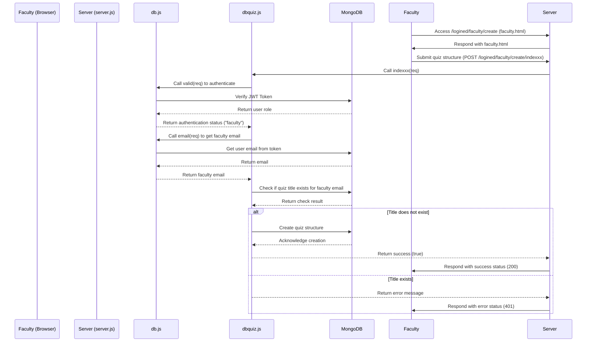

# Quiz Application

This repository contains a **web application for creating and taking quizzes**.
It allows **faculty members** to create quizzes with multiple-choice questions, and **students** to take these quizzes and view their results.

The application is built using **Node.js**, **Express**, **MongoDB**, and **JWT** for authentication.

---

## 📁 Folder Structure

```
angelkoradiya-quiz/
├── db.js                 # Handles database operations for user authentication and signup
├── dbquiz.js             # Handles database operations for quiz creation, questions, and responses
├── package.json          # Lists project dependencies and scripts
├── server.js             # Main server file with routing and middleware setup
└── public/               # Contains static files
    ├── faculty.html          # Faculty quiz creation page
    ├── faculty_update.html   # Faculty quiz update page
    ├── login.html            # Login/signup page
    ├── response.html         # Faculty view for student responses
    ├── result.html           # Student results page
    ├── student.html          # Student quiz-taking page
    └── style.css             # Stylesheet for the application
```

---

## ⚙️ Key Files and Functionality

### **`db.js`**

Manages **user authentication**.

**Exports:**

* `signup` – Registers new users, checks for existing emails, and hashes passwords using bcrypt.
* `login` – Authenticates users, creates a JWT token, and sets it as a cookie.
* `valid` – Verifies JWT token and returns the user's page type (faculty or student).
* `email` – Extracts the user's email from the JWT token.

---

### **`dbquiz.js`**

Handles **quiz-related database operations**.

**Exports:**

* `indexxx` – Creates a new quiz structure (title, COs) and ensures the title is unique per faculty.
* `questionsss` – Adds questions and answers to an existing quiz.
* `answerfromstudent` – Saves student answers and calculates scores.
* `kitteninfo` – Returns available quizzes for students or created quizzes for faculty.
* `responseinfo` – Retrieves student responses for faculty.
* `resultinfo` – Returns quiz results for students.

---

### **`server.js`**

Main entry point of the application.

**Handles:**

* Express server and middleware setup (`body-parser`, `cookie-parser`).
* Routes for:

  * **Authentication:** `/login`, `/signup`, `/logined/logout`
  * **Faculty quiz creation:** `/logined/faculty/create/indexxx`
  * **Faculty quiz update:** `/logined/faculty/update/questionsss`
  * **Student quiz submission:** `/logined/:pagee/answerrr`
  * **Fetching quiz data:** `/logined/:pagee/update/kitten`, `/logined/:pagee/quizinfo`
  * **Responses and results:** `/logined/:pagee/response/kitten`, `/logined/:pagee/resulttttss`
* Serves static files from the `public` directory.
* Uses JWTs and cookies for secure session management.

---

## 🖼️ Public Directory Overview

| File                  | Description                             |
| --------------------- | --------------------------------------- |
| `faculty.html`        | Faculty page to create a quiz           |
| `faculty_update.html` | Faculty page to update existing quizzes |
| `login.html`          | Login and signup page                   |
| `response.html`       | Faculty page to view student responses  |
| `result.html`         | Student page to view quiz results       |
| `student.html`        | Student page to take quizzes            |
| `style.css`           | Main stylesheet for the app             |

---

## 🔁 Sequence Diagram: Quiz Creation by Faculty



---

## 📦 Dependencies

| Package           | Purpose                            |
| ----------------- | ---------------------------------- |
| **bcrypt**        | Password hashing                   |
| **body-parser**   | Parsing request bodies             |
| **cookie-parser** | Handling cookies                   |
| **dotenv**        | Managing environment variables     |
| **express**       | Web server framework               |
| **jsonwebtoken**  | Creating and verifying JWTs        |
| **mongoose**      | MongoDB object modeling            |
| **nodemon**       | Auto-restarting during development |
| **path**          | Handling file paths                |

---

## 🔐 Environment Variables

Create a `.env` file with the following keys:

| Variable       | Description                |
| -------------- | -------------------------- |
| `DB_URL`       | MongoDB connection string  |
| `SECRET_KEY`   | Secret key for JWT signing |
| `PASSWORD_KEY` | Salt rounds for bcrypt     |

---

## 🚀 Running the Application

1. Install dependencies:

   ```
   npm install
   ```

2. Create a `.env` file and add required environment variables.

3. Start the server:

   * For development:

     ```
     npm run dev
     ```
   * For production:

     ```
     npm start
     ```

4. Open your browser and go to:
   [https://quiz-minimal.onrender.com](https://quiz-minimal.onrender.com)

---

## 📄 License


---
**Developed with ❤️ using Node.js, Express, and MongoDB.**
